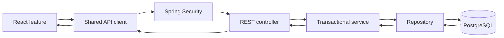

# ApplyFlow Under the Hood

ApplyFlow is a React single-page application backed by a Spring Boot REST API and PostgreSQL. This guide follows one important use case—creating a job application—to explain how the real code crosses UI, HTTP, security, business logic, persistence, and back again.

## The system in one picture



The dependency flow is deliberately direct. ApplyFlow is a focused application, so a layered modular monolith is easier to understand and operate than a distributed or heavily abstracted design.

| Layer | Representative code | Responsibility |
|---|---|---|
| React feature | `frontend/src/features/applications/` | Forms, pages, queries, mutations, and view state |
| HTTP boundary | `frontend/src/lib/api-client.ts` | Base URL, JSON, session credentials, CSRF, and problem responses |
| Security boundary | `SecurityConfig` | Authentication, authorization, session cookie, CSRF, CORS, and OAuth login |
| REST boundary | `JobApplicationController` | Routes, request validation, principal extraction, and HTTP responses |
| Use case | `JobApplicationService` | Business rules, owner context, transactions, and DTO projection |
| Persistence | `JobApplicationRepository`, JPA entities, Flyway migrations | Queries, object mapping, schema, constraints, and indexes |
| Reporting | `AnalyticsService`, `AnalyticsRepository` | Owner-scoped read models and aggregate calculations |

## Creating an application end to end

The concrete lifecycle is:

```text
ApplicationForm
-> toApplicationRequest
-> NewApplicationPage.submit
-> useCreateApplication
-> createApplication
-> apiRequest
-> POST /api/applications
-> Spring Security
-> JobApplicationController.create
-> JobApplicationService.create
-> repositories and PostgreSQL
-> 201 Created + JSON
-> TanStack Query cache update
-> /applications/:id
```

### 1. The form creates an API contract

`ApplicationForm` uses React Hook Form with a Zod resolver. Its `submit` function does not send component state directly:

```tsx
function submit(values: ApplicationFormValues) {
  onSubmit(toApplicationRequest(values))
}
```

`toApplicationRequest` in `frontend/src/features/applications/form-model.ts` trims text, turns control values into numeric IDs, represents absent optional values as `null`, and removes duplicate technology IDs. This translation matters because HTML controls mostly produce strings while `CreateApplicationRequest` in `frontend/src/types/api.ts` has a typed transport shape.

`NewApplicationPage` passes that request to `useCreateApplication`. Its per-call success handler navigates to `/applications/${detail.id}`.

### 2. The API client adds browser security context

`createApplication` in `frontend/src/features/applications/api.ts` calls:

```ts
apiRequest<JobApplicationDetail>('/applications', {
  method: 'POST',
  body: request,
})
```

`apiRequest` prefixes `/api`, serializes the body as JSON, requests `application/json` or `application/problem+json`, and uses `credentials: 'include'` so the browser sends the session cookie.

For `POST`, `PUT`, `PATCH`, and `DELETE`, the client first calls `GET /api/auth/csrf`. It caches the returned token and sends it using the header name supplied by the backend. The browser's same-origin policy prevents another origin from reading that token unless CORS explicitly permits it, which is why the token protects cookie-authenticated unsafe requests from cross-site request forgery.

### 3. Spring Security authenticates and authorizes

`SecurityConfig` uses `HttpSessionCsrfTokenRepository`. It permits only the explicit registration, verification, password-recovery, form-login, OAuth, error, and `OPTIONS` routes without authentication; every other request requires an authenticated principal.

The session identifier is carried in the HTTP-only `APPLYFLOW_SESSION` cookie. Spring Session JDBC stores session records in the `spring_session` and `spring_session_attributes` tables created by `V3__add_identity_sessions_and_ownership.sql`. Cookie `Secure` and `SameSite` behavior is configuration-driven; the production profile enables secure transport and HSTS.

### 4. The controller turns HTTP into a use-case call

`JobApplicationController.create` is mapped to `POST /api/applications`:

```java
public ResponseEntity<JobApplicationDetailResponse> create(
        @AuthenticationPrincipal AuthenticatedUser principal,
        @Valid @RequestBody CreateJobApplicationRequest request) {
    JobApplicationDetailResponse created =
            applicationService.create(principal.userId(), request);
    return ResponseEntity.created(
            URI.create("/api/applications/" + created.id())).body(created);
}
```

Spring MVC selects the method, Jackson deserializes JSON into the `CreateJobApplicationRequest` record, Bean Validation checks its annotations, and Spring Security supplies `AuthenticatedUser`. A successful call returns `201 Created`, a `Location` header, and a `JobApplicationDetailResponse` body.

Passing `principal.userId()` separately is important: ownership comes from the authenticated session, never from a client-supplied owner field.

### 5. The service owns the transaction

`JobApplicationService.create` is annotated with `@Transactional`. Within that transaction it:

1. validates create and salary rules with `JobApplicationValidator`;
2. loads the owning `UserAccount`;
3. resolves an existing owner-scoped company or creates a new one;
4. resolves the shared source and visible technologies;
5. constructs a `JobApplication`;
6. calls `JobApplicationRepository.saveAndFlush`;
7. saves the initial `ApplicationStatusHistory`; and
8. maps the result to `JobApplicationDetailResponse`.

The application row and initial history event commit together. If validation or persistence fails, Spring rolls back the transaction rather than leaving a current status without its matching history.

### 6. JPA and PostgreSQL persist the model

`JobApplication` maps to `job_applications`. It has an owner and company through `@ManyToOne` relationships and technologies through the `job_application_technologies` join table. `JobApplicationRepository` extends `JpaRepository<JobApplication, Long>` and `JpaSpecificationExecutor<JobApplication>`, so Spring Data supplies the implementation at runtime.

JPA is the Java persistence API; Hibernate is the JPA implementation that performs dirty checking and emits SQL through the PostgreSQL JDBC driver. PostgreSQL remains the durable source of truth.

Flyway and Hibernate have different jobs:

- migrations under `backend/src/main/resources/db/migration/postgresql/` create and evolve tables, foreign keys, checks, and indexes;
- JPA annotations map Java objects to that schema at runtime; and
- `spring.jpa.hibernate.ddl-auto=validate` makes Hibernate verify the Flyway-managed schema instead of mutating it.

`V3__add_identity_sessions_and_ownership.sql` adds `owner_id` to companies and applications and enforces a composite company/application ownership foreign key. Repository methods such as `findDetailedByIdAndOwnerId` repeat owner filtering at query time.

### 7. The response refreshes client state

`JobApplicationService.toDetail` loads status history through `findAllByApplicationIdOrderByChangedAtAscIdAsc` and returns a DTO rather than exposing the entity. Jackson serializes the DTO to JSON.

On the frontend, `useApplicationInvalidation` seeds the detail cache and invalidates application-list and tracker queries. `NewApplicationPage` then navigates to the created detail route. The UI therefore reflects the server-confirmed object rather than assuming that the optimistic form state was persisted unchanged.

## Security and owner isolation

ApplyFlow applies tenant isolation at several boundaries:

| Boundary | Enforcement |
|---|---|
| HTTP | Protected routes require an authenticated `AuthenticatedUser` |
| Controller | The owner ID comes from the principal |
| Service | Owner ID is forwarded through application, catalog, extraction, and analytics use cases |
| Repository | Detail/update queries include both resource ID and owner ID |
| Database | Applications reference an owner; the company/application composite foreign key prevents cross-owner pairing |
| Analytics | Every SQL query includes `application.owner_id = :ownerId` |

Application lookups filtered by owner return the same not-found outcome when another user's identifier is supplied. That avoids confirming whether a foreign application exists.

Additional security properties are explicit in the code:

- exact configured CORS origins are used with credentials;
- unsafe browser requests require the session-bound CSRF token;
- the session cookie is HTTP-only, with configurable `Secure` and `SameSite` attributes;
- passwords use Spring Security's delegating password encoder;
- form login, Google OIDC login, remember-me sessions, and logout share the server-side session model; and
- authentication and job-offer extraction pass through application-level rate limiting.

These controls complement, rather than replace, HTTPS, edge controls, monitoring, secret management, and deployment-specific proxy validation.

## Persistence choices and consistency

The persistence design separates current state from historical facts:

- `job_applications.status` makes current lists and filters efficient;
- `application_status_history` records each confirmed transition;
- changing to the current status is an idempotent no-op in `JobApplicationService.changeStatus`; and
- a pessimistic write query protects update/status/delete operations on one application from concurrent lost updates.

The database reinforces application rules with foreign keys, unique indexes, enum-like checks, non-negative salary checks, and a salary-range check. Service validation provides useful API errors; database constraints remain the final integrity boundary.

## Analytics as a read model

Analytics are exposed by `AnalyticsController` under `/api/analytics`. They are backend API capabilities; the shipped React routes do not include an analytics dashboard.

| Endpoint | Semantics |
|---|---|
| `GET /api/analytics/summary` | Counts all applications, then calculates progression counts and rates using applications with `appliedDate` as the denominator |
| `GET /api/analytics/funnel` | Counts distinct applications with an exact recorded funnel status; it does not infer missing stages |
| `GET /api/analytics/applications-over-time?period=WEEK\|MONTH` | Groups non-null `appliedDate` values by PostgreSQL week or month buckets |
| `GET /api/analytics/sources` | Compares applied applications and reached milestones by source |
| `GET /api/analytics/technologies` | Compares applied applications and reached milestones by technology |
| `GET /api/analytics/response-time` | Calculates UTC calendar days from `appliedDate` to the first recorded response-category event, then returns sample size, average, and median |

`AnalyticsRepository` uses `NamedParameterJdbcTemplate` rather than JPA entities for these aggregate projections. That is a pragmatic boundary: transactional application writes use the entity model, while reporting uses explicit SQL shaped for read results.

Response, interview, offer, and rejection flags use status history and can overlap. Percentages use two decimal places. Empty response-time samples return a zero sample size with null average and median. All analytics methods are read-only transactions and all underlying SQL is owner-scoped.

## Safe job-page extraction

`POST /api/job-offers/extract` is authenticated, CSRF-protected, rate-limited, and non-mutating. `JobOfferExtractionService` returns suggestions; it does not create an application, company, or technology.

`SafeHtmlFetcher` reduces server-side request-forgery exposure through layered checks:

1. accept only absolute HTTP or HTTPS URLs without embedded credentials;
2. allow only standard ports 80 and 443;
3. resolve every hostname and reject the request if any resolved address is non-public;
4. connect to the validated address while retaining hostname verification and SNI for TLS;
5. revalidate every redirect and reject HTTPS-to-HTTP downgrades;
6. accept only HTML/XHTML responses;
7. enforce connect, read, total-time, redirect, header, compressed-body, and decompressed-body limits; and
8. bound concurrent fetches and DNS work.

After a safe fetch, `JobOfferExtractionService` prefers Schema.org `JobPosting` JSON-LD. If structured data is absent, it uses conservative metadata fallbacks and returns warnings plus per-field confidence. Existing-company matching is owner-scoped. The browser applies suggestions only to untouched empty fields, leaving the user in control before saving.

No URL-fetching control makes arbitrary remote content risk-free. The bounded fetcher should still run behind network egress policy, observability, and infrastructure-level rate limits in production.

## Why this architecture fits

The design favors understandable boundaries over ceremony:

- controllers stay thin and HTTP-focused;
- services group business transactions and are constructor-injected;
- DTOs keep transport contracts separate from entities;
- repositories isolate persistence mechanics;
- explicit SQL is used where reporting needs differ from entity workflows; and
- the frontend keeps feature logic near its pages while centralizing HTTP security behavior.

There are deliberate tradeoffs. `JobApplicationService` coordinates several repositories because creating and updating an application is a cohesive cross-table use case. `SafeHtmlFetcher` is infrastructure-heavy because outbound network input requires stricter controls than an ordinary HTTP client. Neither complexity is hidden behind abstractions that would add indirection without changing behavior.

## A source-reading path

Read these files in order to reconstruct the core flow:

1. `frontend/src/features/applications/ApplicationForm.tsx`
2. `frontend/src/features/applications/form-model.ts`
3. `frontend/src/features/applications/NewApplicationPage.tsx`
4. `frontend/src/features/applications/api.ts`
5. `frontend/src/lib/api-client.ts`
6. `backend/src/main/java/com/applyflow/config/SecurityConfig.java`
7. `backend/src/main/java/com/applyflow/controller/JobApplicationController.java`
8. `backend/src/main/java/com/applyflow/dto/application/CreateJobApplicationRequest.java`
9. `backend/src/main/java/com/applyflow/service/JobApplicationService.java`
10. `backend/src/main/java/com/applyflow/entity/JobApplication.java`
11. `backend/src/main/java/com/applyflow/repository/JobApplicationRepository.java`
12. `backend/src/main/resources/db/migration/postgresql/V3__add_identity_sessions_and_ownership.sql`

If you can explain where validation, authentication, authorization, transactionality, persistence, and cache refresh happen in that sequence, you understand ApplyFlow's central architecture.
